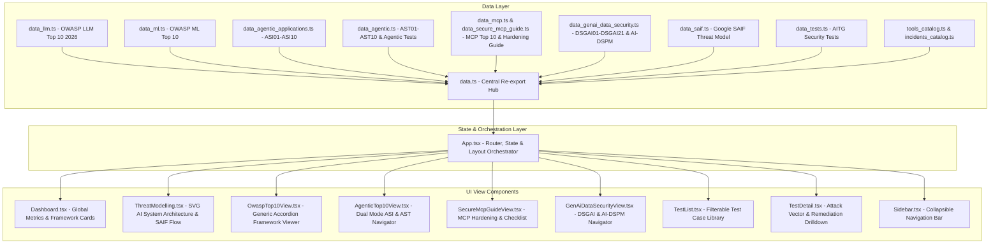

# System Architecture & Technical Design

> **Project**: AI Security Nexus (OWASP-AI-Testing-Bible)  
> **Type**: High-Performance Client-Side SPA (Single Page Application)  
> **Framework**: React 18, TypeScript, Tailwind CSS, Bootstrap Grid SCSS, Vite 6

---

## 1. High-Level Architecture Topology

AI Security Nexus is engineered as a zero-latency, client-side security command center. It unifies static security standards from OWASP and Google into an interactive exploration engine without requiring a backend API server.

---

## 2. Component Hierarchy & Navigation Routing

The application avoids heavy URL-routing libraries in favor of high-speed deterministic state switching in [`App.tsx`](file:///Users/gabrielemossino/Documents/GitHub/OWASP-AI-Testing-Bible/App.tsx):

- **State Model**:
  - `currentView`: `'dashboard' | 'tests' | 'detail' | 'threat-model' | 'owasp-top10' | 'owasp-ml-top10' | 'owasp-agent-top10' | 'owasp-saif-top10' | 'owasp-mcp-top10' | 'secure-mcp-guide' | 'genai-data-security'`
  - `activePillar`: `Pillar | 'ALL' | 'TOP10' | 'MLTOP10' | 'AGENTTOP10' | 'SAIFTOP10' | 'MCPTOP10' | 'SECUREMCPGUIDE' | 'GENAIDATASECURITY'`
  - `selectedTest`: `TestItem | null`
  - `owaspTargetId`: `string | null` (used to auto-expand an entry when jumping from dashboard or threat model)
  - `isSidebarOpen`: `boolean` (mobile responsive drawer state)

---

## 3. Interactive Threat Modeling & SVG Visualization Engine

In [`components/ThreatModelling.tsx`](file:///Users/gabrielemossino/Documents/GitHub/OWASP-AI-Testing-Bible/components/ThreatModelling.tsx):
- **Visual AI Pipeline**: A graphical SVG representation of the 4 AI Architecture Layers:
  1. **Application Layer**: User interface, API gateways, agent planners, orchestrators.
  2. **Model Layer**: LLMs, fine-tuned weights, embeddings, inference pipelines.
  3. **Data Layer**: RAG corpora, vector databases, training datasets, caches.
  4. **Infrastructure Layer**: MCP servers, compute clusters, execution sandboxes, storage.
- **SAIF Risk Flow**: An interactive lifecycle matrix showing where each risk is **Introduced**, **Exposed**, and **Mitigated**, with deep linking directly into the corresponding security test cases or framework views.

---

## 4. Build, Packaging & Performance Optimization

- **Bundling**: Vite 6 transforms React JSX/TSX and PostCSS/Tailwind styles into static assets under `dist/`.
- **Content Security Policy (CSP)**: Handled at build-time in `vite.config.ts`, injecting strict CSP meta headers to prevent XSS and data exfiltration.
- **Base Path Resolution**: In `vite.config.ts`, dynamic base path resolution (`process.env.BASE_PATH || (repo ? '/'+repo+'/' : '/')`) ensures correct asset paths whether running on custom domains or GitHub Pages project subpaths.
